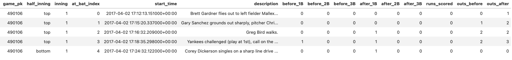
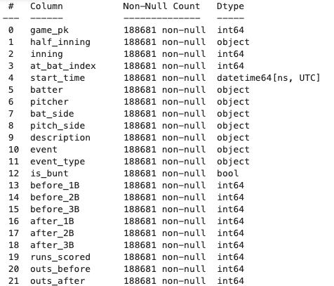
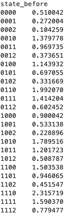
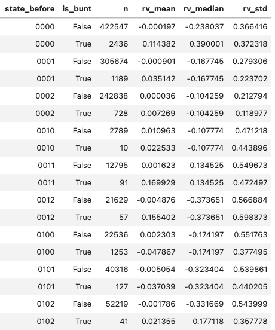
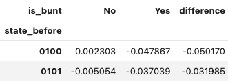
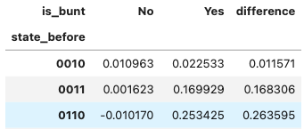

# To Bunt or Not to Bunt: A Data-Driven Look at Run Expectancy in MLB

**Author:** Jack Van Vooren, B.S. Computer Science, University of Wisconsin-Madison  
**Tools Used:** Python (Jupyter Notebook, Pandas), [MLB Stats API Python Package](https://github.com/toddrob99/MLB-StatsAPI)

---

## Overview

As the 2025 MLB season was just getting underway, I was filled with excitement as my favorite sport was back on. I was tuned in to the first week of games of my favorite team and saw the Brewers win a game in thrilling fashion with a walkoff bunt. Once the excitement of the first walkoff win of the season settled down, I began to think about the strategy behind bunting and whether or not it was beneficial as opposed to swinging away in certain situations.

Baseball has always balanced numbers and intuition, and the bunt sits right in that gray area between analytics and feel. My goal of this project was to measure how bunting affects a team's ability to score runs using objective data, rather than tradition or gut instinct (Although I feel strongly that both are important). 

**Specifically, I wanted to quantify whether bunting increases or decreases a team's run expectancy (RE)**, the average number of runs expected to score before the end of an inning, across different base-out situations.

---

## Methodology

### 1. Data Collection

All data came from the MLB Stats API, which provides detailed play-by-play information for every game. Using Python's statsapi library, I collected all regular-season game_playByPlay records from 2016 through 2025, a total of 1,725,242 unique plays. I felt that collecting ten seasons of data helped smooth out year-to-year variation and ensured that the bunt analysis was statistically reliable.

Each play was processed to record:
- Base runners on 1st, 2nd, and 3rd at the start and end of the play
- Number of outs before and after the play
- Runs scored during the play
- Event type (bunt, hit, strikeout, etc.)
- Batter and pitcher handedness

Here is a snippet of my data collection table:




---

### 2. Creating and Calculating Run Expectancy Table

To calculate the average number of runs remaining from each state, I wrote a script that looked ahead from every play to see how many runs scored before the end of that half-inning. That allowed me to assign a "runs scored" to each 'before_state' (Example: Man on first, zero outs). When grouping by and finding the mean run expectancy from each 'before_state', I was able to create a table that assigned a Run Expectancy value to each starting state.

Here is the table that I created for seasons 2016-2025 (each state is given in 1b2b3bOuts format. For example: 1st and 3rd with 2 outs would be 1012. The second column is Runs Expected the Rest of the Inning):



---

### 3. Run Value of Each Play

The last step in my data collection was to assign a run value to each play that was a 'batter decision' (exclude steals, wild pitches, etc.). This would allow me to finally get my answer to the question To Bunt or Not to Bunt? The formula that I used was:
```
run_value = runs_scored + after_runs_expected - before_runs_expected
```

(Find the change in RE from the state change + count the runs that scored on the play)

---

## Results

Now the fun part, I finally was able to get some insight into the question. My process consisted of aggregating all run_values grouped by state_before. Next, I divided outcomes based on whether the play was a bunt or not. This allowed me to see whether or not the average run value of a bunt was higher or lower than swinging away in each scenario.

Here is a snippet of my table comparing the value of the bunt in each scenario (state follows same 1b2b3bOuts format):



---

### Key Findings

The most striking observation to me was the "Runner on Second" scenario. I had always thought of this as the most logical sacrifice situation but in opportunities for a sac bunt (0 or 1 outs) the RE actually was lower following a bunt than a traditional at bat. 

Here are the two scenarios with a runner on second and less than 2 outs:



A second conclusion that I had was when a runner's already on 3rd base and there's one out, bunting can slightly raise expected runs. That's because it increases the probability of the runner scoring even if it costs an out. I did have to factor in that a few of these scenarios are probably surprise bunts or squeezes but as an avid baseball fan, I do believe that if a squeeze bunt is placed correctly, there is not much that the defense can do.



---

## Conclusions

Overall, across ten seasons of data, bunting reduced average run expectancy in almost every base-out state. The most significant declines occurred with runners on first or first and second with no outs, the classic sacrifice situations. However, when a runner was already on third base with one out or zero outs, bunting slightly increased run expectancy, suggesting that well-placed squeezes or safety bunts can still be effective.

---

## Limitations

As a big baseball fan I understand that this analysis does not account for inning, score differential, or batter skill level, all of which can heavily influence the decision to bunt. It also assumes that each play is independent, even though managers often make decisions based on the next hitters' strengths or the opposing pitcher's tendencies. Including those variables would make the model more realistic, but for the scope of this project, I focused on isolating the run expectancy effects of the bunt itself.

---

## Coming Soon

The next step for me is to explore scenarios where only one run is needed to win, such as extra innings or bottom-of-the-ninth tie games. I'd use win expectancy (WE) instead of run expectancy. Managers may give up long-term expected runs to increase the probability of scoring a single game-winning run.

---

## Repository Contents

- `analyze_data.ipynb` - Main analysis notebook
- `getdata.ipynb` - Data collection from MLB Stats API
- `*.parquet` files - Collected play-by-play data (2016-2025)
- `images/` - Visualizations and tables for README
